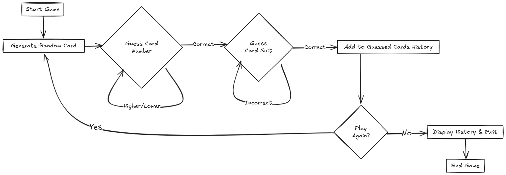

# Card Guessing Game

## Exercise Statement

In this exercise, you will implement a simple card guessing game using Java. The game involves the following steps:

1. **Generate a Random Card**:
   - A card consists of a number (1-13) and a suit (Hearts, Diamonds, Clubs, Spades).
   - Use the `CardGame` class to generate a random card.

2. **Guess the Card**:
   - The player will first guess the card number (1-13).
   - Provide feedback if the guessed number is too high or too low until the correct number is guessed.
   - Once the number is guessed correctly, the player will guess the card suit.
   - Provide feedback if the guessed suit is incorrect until the correct suit is guessed.

3. **Track Guessed Cards**:
   - Maintain a history of all correctly guessed cards.

4. **Replay Option**:
   - After guessing a card correctly, ask the player if they want to play again.
   - If the player chooses to play again, generate a new random card and repeat the process.
   - If the player chooses to quit, display the history of all guessed cards and exit the game.

## Game Flow Diagram




## Classes and Methods

### `CardGame` Class
- **Purpose**: To generate a random card.
- **Method**:
  - `generateRandomCard()`: Returns a `HashMap` containing the card's number and suit.

### `GuessTheCard` Class
- **Purpose**: To implement the game logic.
- **Key Features**:
  - Accept user input for guessing the card number and suit.
  - Provide feedback for incorrect guesses.
  - Maintain a history of guessed cards.
  - Allow the player to replay or quit the game.

## How to Run
1. Compile the Java files:
   ```bash
   javac CardGame.java GuessTheCard.java
   ```
2. Run the game:
   ```bash
   java GuessTheCard
   ```

## Example Output
```
Guess the card number (1-13): 
5
The number is greater than 5
8
The number is less than 8
7
Correct! Now guess the suit.
Guess the card suit (Hearts, Diamonds, Clubs, Spades): 
Clubs
Incorrect suit. Try again!
Hearts
Correct! You guessed the card: 7 of Hearts
Do you want to play again? (yes/no): 
no
Guessed cards history: [7 of Hearts]
Thanks for playing! Goodbye!
```

## Notes
- Use the `CardGame` class to encapsulate card generation logic.
- Ensure proper input validation and error handling.
- Use an `ArrayList` to store the history of guessed cards.
