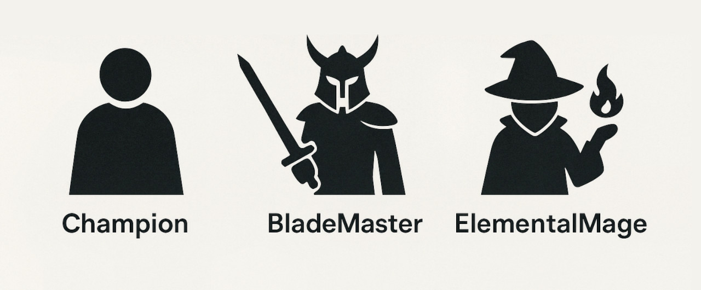

## ☕ Java Code Review OOP Assignment
### 🕹️ **RPG Game**



---

### 🎯 Objective:
In this code review, we will **collaboratively implement an RPG-style game** using Object-Oriented Programming principles in Java. The goal is to understand **inheritance, abstraction, polymorphism, and interfaces** while working with real-world logic.

---

### 📦 Class Hierarchy Overview:

We will implement:

- An **abstract base class**: `Champion` -> parent class
- Two **subclasses**: `BladeMaster` and `ElementalMage`
- Two **interfaces**:
  - `IHealthBottleBearer`
  - `IManaBottleBearer`

---

### 🧱 1. Abstract Class: `Champion`

Create an abstract class `Champion` with:

#### Fields:
- `String name`
- `int health`
- `int attackDamage`

#### Constructor:
- Takes all three values as parameters and initializes them.

#### Methods:
- `public void attack(Champion target)`  
  Reduces the target's health by `attackDamage` and prints:
  ```
  <name> attacked <target.name> for <attackDamage> damage.
  <target.name>'s health is now <newHealth>.
  ```

- `public abstract void useAbility();`
- `public abstract void die();`

---

### ⚔️ 2. Class: `BladeMaster`

This class extends `Champion`.

#### Additional Fields:
- `boolean rage` (default: `false`)
- `int rageTurns` (default: `0`)

#### Constructor:
- Accepts `String name`
- Sets:
  - `health = 100`
  - `attackDamage = 20`
  - `rage = false`
  - `rageTurns = 0`

#### Method Overrides:
- `attack(Champion target)`:
  - If `target.health <= 0`, print:  
    `"Target <target.name> is already defeated."` and cancel the attack.
  - If `rage == true`, deal **double damage**.
  - Decrease `rageTurns` by 1.
  - If `rageTurns == 0`, set `rage = false` and print:  
    `"BladeMaster <name>'s rage has faded."`

- `useAbility()`:
  - If not already in rage:
    - Set `rage = true`
    - Set `rageTurns = 2`
    - Print: `"BladeMaster <name> has entered rage mode!"`

- `die()`:
  - Print: `"BladeMaster <name> has fallen in battle."`

---

### 🔥 3. Class: `ElementalMage`

This class extends `Champion` and implements **two interfaces**:
- `IHealthBottleBearer`
- `IManaBottleBearer`

#### Additional Fields:
- `int mana = 100`
- `boolean pickedUpHealthBottle = false`
- `boolean pickedUpManaBottle = false`

#### Constructor:
- Accepts `String name`
- Sets:
  - `health = 80`
  - `attackDamage = 10`
  - `mana = 100`

#### Method Overrides:
- `attack(Champion target)`:
  - Use the base `attack()` logic from `Champion`.

- `useAbility()`:
  - Print: `"ElementalMage <name> is preparing to cast a Fireball."`

- `die()`:
  - Print: `"ElementalMage <name> has been defeated."`

#### New Method:
- `public void castFireball(Champion target)`:
  - If `mana >= 30`:
    - Deal `attackDamage * 3` to target.
    - Subtract 30 mana.
    - Print:
      ```
      ElementalMage <name> casts Fireball on <target.name> for <damage> damage!
      <name>'s mana is now <mana>.
      ```
  - Else:
    - Print: `"Not enough mana to cast Fireball!"`

---

### 🧪 4. Interface: `IHealthBottleBearer`

```java
public interface IHealthBottleBearer {
    void pickUpHealthBottle();
    void useHealthBottle();
    boolean isPickedUpHealthBottle();
    void setPickedUpHealthBottle(boolean value);
}
```

#### Behavior:
- `useHealthBottle()` increases health by **20 points** if `pickedUpHealthBottle == true` and sets it back to `false`.

---

### 💧 5. Interface: `IManaBottleBearer`

```java
public interface IManaBottleBearer {
    void pickUpManaBottle();
    void useManaBottle();
    boolean isPickedUpManaBottle();
    void setPickedUpManaBottle(boolean value);
}
```

#### Behavior:
- `useManaBottle()` increases mana by **40 points** if `pickedUpManaBottle == true` and sets it back to `false`.

---

### ✅ BONUS CHALLENGE *(Optional)*

Add a method `boolean isDead()` in `Champion` that returns true if health is `<= 0`.