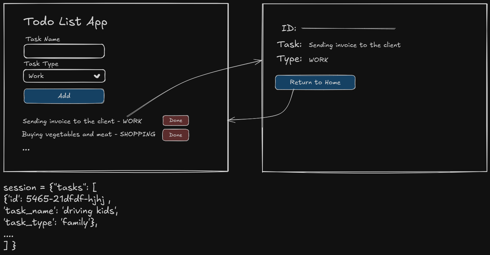

# Live Coding: Flask Todo List Application

This is a simple web application built with Flask that allows users to manage a Todo List. Users can:
- Add tasks with a description and type
- View all tasks
- See details for each task
- Delete tasks
- Each **task** is assigned a unique ID and **tasks** are stored in the **Flask session**


---

## What Will Be Covered

- Setting up a Flask project and environment
- Creating and using Flask routes
- Handling forms and user input
- Using Flask's session to store data
- Rendering templates with Jinja2
- Assigning unique IDs to tasks using the `uuid` module
- Basic HTML and Bootstrap for UI

## Steps

1. **Project Setup**
    - Create a new directory for your project.
    - Initialize pipenv and install Flask:
      ```sh
      pipenv install flask
      ```
    - Create the following files:
      - `server.py`
      - `home.html`
      - `one_task.html`

2. **Core Features**
    - Add tasks with a description and type ("Work" or "Home").
    - Assign a unique ID to each task using the `uuid` module (e.g., `uuid.uuid4()`).
    - Display all tasks on the homepage, grouped or styled by type.
    - Allow users to delete tasks.
    - Allow users to view details of a single task.

3. **Bonus Ideas**
    - Add task editing.
    - Improve the UI with Bootstrap or custom CSS.
    - Refactor and clean up code as needed.

4. **Running the App**
    - Start your environment and run the server:
      ```sh
      pipenv shell
      python server.py
      ```
    - Visit `http://127.0.0.1:5000/` in your browser.

Happy coding!
