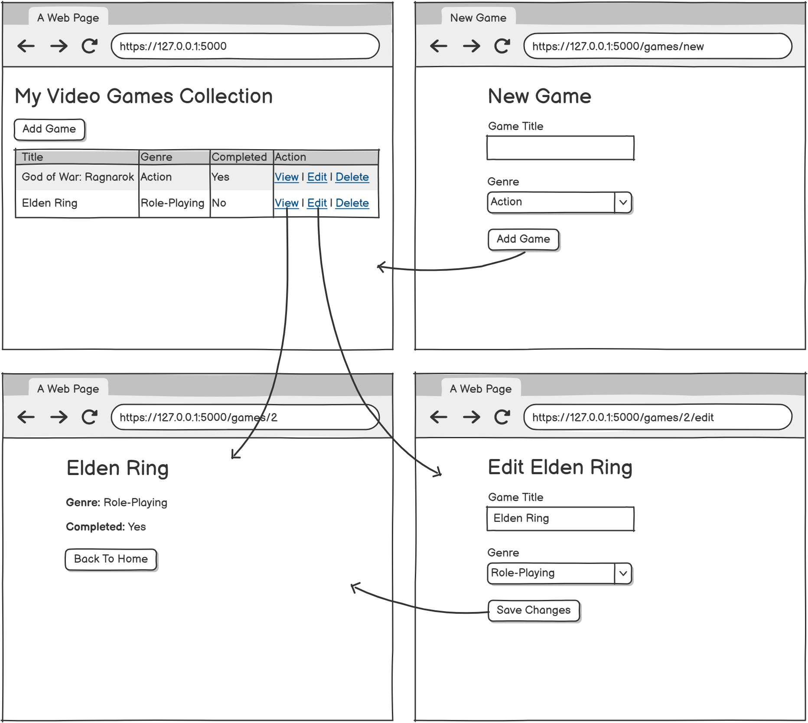

# Video Games Collection

## Objective

Build a simple Flask web application to manage a collection of video games. This project will help you practice CRUD (Create, Read, Update, Delete) operations, templating with Jinja2, and basic web development with Python, Flask, and MySQL.

---

## Requirements

1. **Display Games List**
   - Show all video games in a table on the home page.
   - Each game should display its title, genre, and completion status.

2. **Add New Game**
   - Provide a form to add a new game (title, genre, completed: yes/no).

3. **View Game Details**
   - Allow users to view details of a single game.

4. **Edit Game**
   - Allow users to edit an existing game's information.

5. **Delete Game**
   - Allow users to delete a game from the collection.

6. **Styling**
   - Use Bootstrap for basic styling.

---

## Wireframe:

<!-- **Home Page with Games List:**


**Game Details page:**


**New Game page:**


**Edit Game page:**

 -->



---

## Bonus

- Include an image for each game.

---

## Getting Started

1. **Install dependencies:**
   ```bash
   pip install flask pymysql
   ```

2. **Run the app:**
   ```bash
   python server.py
   ```

3. **Open your browser and go to:**
   ```
   http://localhost:5000
   ```

---

## Good luck and have fun!
